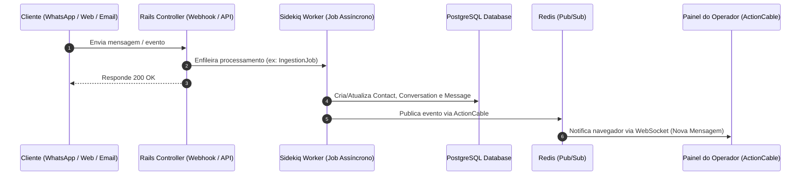

# Arquitetura do Sistema - Kallia CRM

Este documento descreve a arquitetura técnica, estrutura de pastas, fluxos de dados, componentes principais e diretrizes de execução do **Kallia CRM** (baseado no ecossistema Chatwoot).

---

## 1. Visão Geral do Sistema

O **Kallia CRM** é uma plataforma de atendimento ao cliente *omnichannel* moderna, projetada para centralizar a comunicação de múltiplos canais em um único painel em tempo real, integrando automações, suporte a múltiplos operadores (agentes), relatórios e assistência por Inteligência Artificial.

### Principais Capacidades:
- **Inbox Unificado:** Centralização de conversas de WhatsApp, Instagram, Facebook, E-mail, Telegram, SMS e Web Widget.
- **Comunicação em Tempo Real:** Atualizações instantâneas de mensagens, status de presença e digitação via WebSockets (ActionCable).
- **IA & Copiloto (Captain):** Automação de respostas, sugestões contextuais e integração com modelos LLM.
- **Ferramentas Visuais de Feedback (Agentation):** Inspeção e anotação visual de elementos na interface em desenvolvimento e produção na VPS.
- **Enterprise Ready:** Suporte a multi-tenancy (contas isoladas), RBAC (administradores, agentes), MFA/2FA e criptografia de dados em repouso.

---

## 2. Stack Tecnológica

| Camada | Tecnologia | Descrição / Função |
| :--- | :--- | :--- |
| **Backend** | Ruby on Rails 7.x | Framework principal da API, regras de negócio e persistência |
| **Frontend** | Vue.js 3 + Vite | Single Page Application (SPA) reativa com Composition API |
| **Estilização** | TailwindCSS | Design System utilitário padronizado |
| **Banco de Dados** | PostgreSQL | Banco relacional com suporte a índices avançados e Full-Text Search |
| **Fila & Cache** | Redis + Sidekiq | Gerenciamento de cache, sessões e execução de Background Jobs concorrentes |
| **Tempo Real** | Rails ActionCable | Servidor de WebSockets integrado ao Redis Pub/Sub |
| **Autenticação** | Devise + JWT / Token | Sessões seguras, autenticação de APIs e suporte a 2FA/MFA |
| **Orquestração Dev** | Overmind / Foreman | Gerenciamento de processos simultâneos via `Procfile.dev` |

---

## 3. Estrutura de Diretórios Principal

```
├── app/                        # Núcleo da aplicação Rails e Assets Frontend
│   ├── controllers/            # Controladores da API REST e Super Admin
│   ├── models/                 # Modelos de dados ActiveRecord e validações
│   ├── services/               # Serviços de negócio (ex: envio de mensagens, integrações)
│   ├── jobs/                   # Background Jobs processados pelo Sidekiq
│   ├── mailers/                # Templates e envio de e-mails
│   ├── views/                  # Layouts HTML/ERB (ex: layouts/vueapp.html.erb)
│   └── javascript/             # Código Frontend (Vue 3 / Vite)
│       ├── entrypoints/        # Pontos de entrada compilados pelo Vite (dashboard.js, v3app.js)
│       ├── dashboard/          # Aplicação principal do painel do operador (rotas, stores, views)
│       ├── v3/                 # Telas e componentes da interface V3
│       ├── widget/             # Widget de chat embutível para sites externos
│       ├── components-next/    # Biblioteca moderna de componentes de UI
│       └── shared/             # Utilitários, helpers e integrações (ex: agentation.js)
├── config/                     # Configurações do Rails, rotas, inicializadores e integrações
├── db/                         # Esquema do banco (schema.rb), migrações e seeds
├── deployment/                 # Scripts de provisionamento VPS, Systemd services e Nginx
├── docker/                     # Dockerfiles e scripts de inicialização de containers
├── lib/                        # Classes utilitárias, clientes de integração e hooks globais
├── public/                     # Arquivos estáticos e saída compilada do Vite
├── spec/                       # Testes automatizados (RSpec / Vitest)
├── .agents/                    # Skills e configurações para agentes de IA (ex: Agentation)
└── ENTERPRISE_FEATURES.MD      # Catálogo de recursos para recriação 100% Open Source
```

---

## 4. Camadas e Padrões Arquiteturais

### 4.1 Backend (Ruby on Rails)
- **Controllers:** Focados estritamente na recepção de requisições, validação de parâmetros fortes (*Strong Parameters*) e resposta JSON formatada via Presenters/Jbuilder.
- **Models:** Contêm validações de presença/unicidade, escopos e relacionamentos. Lógicas complexas são delegadas para Services.
- **Services (`app/services`):** Encapsulam regras de negócio e fluxos multi-etapas (ex: `Messages::CreateService`, `Whatsapp::IncomingMessageService`).
- **Arquitetura 100% MIT Open Source:** O código proprietário da pasta `enterprise/` foi removido. Funcionalidades avançadas (SLAs, papéis customizados, auditoria) estão mapeadas para desenvolvimento nativo em [ENTERPRISE_FEATURES.MD](./ENTERPRISE_FEATURES.MD).

### 4.2 Frontend (Vue 3 + Vite)
- **Modularidade por Entrypoints:**
  - `dashboard.js`: Painel de controle completo para agentes e administradores.
  - `widget.js`: SDK leve e isolado para o balão de chat no site do cliente final.
  - `v3app.js`: Interface atualizada de telas de autenticação e novos módulos.
- **Estado Global:** Gerenciado de forma previsível com Pinia e Vuex.
- **Code-Splitting Sob Demanda:** Recursos pesados ou contextuais (como o **Agentation**) são carregados via `import()` dinâmico apenas quando ativados.

---

## 5. Fluxos de Dados e Ciclo de Vida de Mensagens



1. **Ingestão:** Mensagens recebidas por Webhooks externos (WhatsApp Cloud API, SendGrid, etc.) são validadas e enfileiradas imediatamente no Sidekiq.
2. **Persistência:** O job do Sidekiq resolve o contato, localiza ou abre uma conversa no banco de dados e cria o registro da mensagem.
3. **Distribuição em Tempo Real:** O Rails emite o evento no canal ActionCable correspondente à conta/conversa, atualizando o painel do operador sem necessidade de refresh.
4. **Disparo de Resposta:** Quando o operador responde, o serviço específico do canal conecta à API externa para envio, atualizando o status da mensagem (enviada, entregue, lida).

---

## 6. Autenticação, Permissões e Segurança

- **Autenticação de Usuários:** Gerenciada via `Devise`, com suporte a senhas criptografadas (BCrypt), autenticação multifator (MFA/2FA via TOTP) e login social OAuth.
- **Controle de Acesso (RBAC):**
  - `SuperAdmin`: Gerenciamento global de instâncias, configurações de servidor e criação de contas.
  - `Administrator`: Gestão da conta (configurações de inboxes, integrações, relatórios e equipe).
  - `Agent`: Visualização e atendimento de conversas atribuídas ou abertas.
- **Privacidade & Telemetria:** Suporte nativo a `DISABLE_TELEMETRY=true`, desativando qualquer envio de métricas ou pings a servidores externos.

---

## 7. Ferramentas Integradas: Agentation

O **Agentation** está integrado ao ecossistema para permitir anotações visuais interativas e feedback direto para agentes de IA:

- **Carregamento Condicional:** Se desativado, o overhead no bundle é **0 KB** devido ao carregamento assíncrono.
- **Modos de Ativação:**
  - **No `.env` (Global VPS):** `ENABLE_AGENTATION=true` e opcionalmente `AGENTATION_ENDPOINT=http://localhost:4747`.
  - **Na URL (Por Sessão):** Adicione `?agentation=true` à URL do navegador.
  - **No Console do Navegador:** `window.AgentationManager.enable()`.

---

## 8. Guia de Execução e Deploy

### 8.1 Desenvolvimento Local
```bash
# 1. Instalar dependências
bundle install
pnpm install

# 2. Configurar banco de dados
bundle exec rails db:create db:migrate db:seed

# 3. Iniciar todos os serviços (Rails, Vite, Sidekiq)
pnpm dev
# ou
overmind start -f Procfile.dev
```

### 8.2 Deploy em Produção (VPS)
1. **Configuração de Ambiente:** Preencher o arquivo `.env` com base no `.env.example`.
2. **Serviços Recomendados:**
   - **Web Server:** Puma gerenciado via Systemd (`deployment/chatwoot-web.1.service`) atrás de um proxy reverso Nginx com SSL (`deployment/nginx_chatwoot.conf`).
   - **Worker:** Sidekiq gerenciado via Systemd (`deployment/chatwoot-worker.1.service`).
   - **Banco & Cache:** PostgreSQL 14+ e Redis 6+.
3. **Build de Assets:**
   ```bash
   pnpm run build:sdk
   bundle exec rails assets:precompile
   ```
